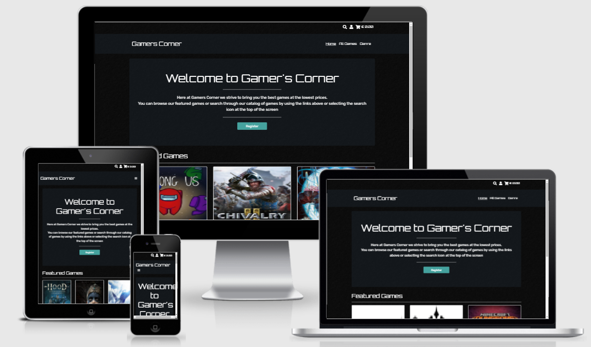
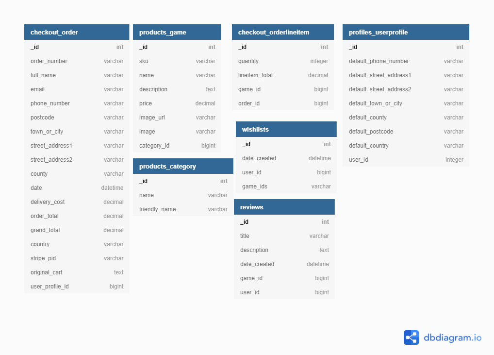

<h1 align="center">Gamers Corner</h1> 
The scope for this project is to create a user centric e-commerce website using Python, Django, Postgres and Heroku.
  
Gamers Corner, An e-commerce website were a user can search for and purchase games for gaming consoles as well as setup a user account to allow them to view their order history and user details.
  

# Table of contents
- [UX](#user-experience)
    - [User stories](#user-stories)
    - [Design](#design)
    - [Surface Plane](#surface-plane)
    - [Wireframes](#wireframes)
- [Technologies Used](#technologies-used)
    - [Languages and Frameworks](#languages-and-frameworks)
- [Database Schema](#database-schema)
- [Database and Schema](#database-and-schema)
    - [Postgres Setup](#Postgres-setup)
- [Deployment](#deployment)
    - [Forking the GitHub Repository](#forking-the-github-repository)
    - [Making a Local Clone](#making-a-local-clone)
    - [Heroku Deployment](#heroku-deployment)
- [Credits](#credits)
- [Content](#content)
- [Acknowledgements](#acknowledgements)

# User Experience
## User stories
 -   ### First Time Customer Goals
       1. As a First Time Customer, I want to be able to view a list of games.
       2. As a First Time Customer, I want to be able to view an induvial games details.
       3. As a First Time Customer, I want to be able to view my total purchases.
       4. As a First Time Customer, I want to be able to view the products I have selected.
       5. As a First Time Customer, I want to be able to setup a user account / registration.
 
 -   ### Returning or Frequent User Goals
       1. As a Returning User, I want to be able to log in.
       2. As a Returning User, I want to be able to log out.
       3. As a Returning User, I want to be able delete my account.
       4. As a Returning User, I want to be able add personal details.
       5. As a Returning User, I want to be able update personal details.
       6. As a Returning User, I want to be able view my order history.
 
 -   ### Frequent Administrator Goals
       1. As a Frequent Administrator, I want to be able to see all customer and user orders.
       2. As a Frequent Administrator, I want to be able to see all users.
       3. As a Frequent Administrator, I want to be able to add products to the site.
       4. As a Frequent Administrator, I want to be able to update product details.
       5. As a Frequent Administrator, I want to be able to delete products from the site.
       6. As a Frequent Administrator, I want to be able to add categories to the site.
       7. As a Frequent Administrator, I want to be able to edit category names.
       8. As a Frequent Administrator, I want to be able to delete categories.
 
 -   ### Sorting and Searching Goals
       1. Sort a list of Products, either alphabetically A-Z or Z-A.
       2. Search for a Product, either by description or by name. 
       3. Sort Products in a category.

 -   ### Purchasing and Checkout Goals
       1. Add a product to the cart.
       2. Update the induvial product quantities.
       3. Remove a product from the cart.
       4. Purchase the products in the cart.
       5. Sent confirmation email of a purchase / order.

# Design
## Strategy Plane
Gamers Corner aims to provide users the ability to purchase games and track order history through a profile page

The objective of this project is to give the user an e-Commerce experience with a minimal profile for order tracking.

## Scope Plane
This project will look to provide an e-Commerce platform for purchasing games.

The website will convey the developers use of Python (mainly Django Framework), HTML, CSS and jQuery.

## Structure Plane
As the aim of the site is to provide an e-Commerce platform to the users the site was developed to be a linear multi-page site. The User has access to navigation in the top right of the home page and in a pop out menu on mobile.

## Skeleton Plane
From the structure above I was able to generate the below Wireframes for the site, while these wireframes are guidelines for building the main structure of the site the layout of the content is subject to change.

### Wireframes

-   #### Balsamiq - [View](https://github.com/KevAndrews/Milestone_Project_4/blob/main/wireframes/MS4_Wireframes.bmpr)

-   #### Desktop
    1. Home Page - [View](https://github.com/KevAndrews/Milestone_Project_4/blob/main/wireframes/desktop/Home%20Page%20Desktop%20View.png)
    2.  Cart Page - [View](https://github.com/KevAndrews/Milestone_Project_4/blob/main/wireframes/desktop/Cart%20Page%20Desktop%20View.png)
    3. Confirmation Page - [View](https://github.com/KevAndrews/Milestone_Project_4/blob/main/wireframes/desktop/Confirmation%20Page%20Desktop%20View.png)
    4. Game Page - [View](https://github.com/KevAndrews/Milestone_Project_4/blob/main/wireframes/desktop/Game%20Page%20Desktop%20View.png)
    5. Genre Page - [View](https://github.com/KevAndrews/Milestone_Project_4/blob/main/wireframes/desktop/Genre%20Page%20Desktop%20View.png)
    6. Login Page - [View](https://github.com/KevAndrews/Milestone_Project_4/blob/main/wireframes/desktop/Login%20Page%20Desktop%20View.png)
    7. Profile Page - [View](https://github.com/KevAndrews/Milestone_Project_4/blob/main/wireframes/desktop/Profile%20Page%20Desktop%20View.png)
    8. Sign-Up Page - [View](https://github.com/KevAndrews/Milestone_Project_4/blob/main/wireframes/desktop/Sign-Up%20Page%20Desktop%20View.png)

-   #### Tablet
    1. Home Page - [View](https://github.com/KevAndrews/Milestone_Project_4/blob/main/wireframes/tablet/Home%20Page%20Tablet%20View.png)
    2.  Cart Page - [View](https://github.com/KevAndrews/Milestone_Project_4/blob/main/wireframes/tablet/Cart%20Page%20Tablet%20View.png)
    3. Confirmation Page - [View](https://github.com/KevAndrews/Milestone_Project_4/blob/main/wireframes/tablet/Confirmation%20Page%20Tablet%20View.png)
    4. Game Page - [View](https://github.com/KevAndrews/Milestone_Project_4/blob/main/wireframes/tablet/Game%20Page%20Tablet%20View.png)
    5. Genre Page - [View](https://github.com/KevAndrews/Milestone_Project_4/blob/main/wireframes/tablet/Genre%20Page%20Tablet%20View.png)
    6. Login Page - [View](https://github.com/KevAndrews/Milestone_Project_4/blob/main/wireframes/tablet/Login%20Page%20Tablet%20View.png)
    7. Profile Page - [View](https://github.com/KevAndrews/Milestone_Project_4/blob/main/wireframes/tablet/Profile%20Page%20Tablet%20View.png)
    8. Sign-Up Page - [View](https://github.com/KevAndrews/Milestone_Project_4/blob/main/wireframes/tablet/Sign-Up%20Page%20Tablet%20View.png)
-   #### Mobile
    1. Home Page - [View](https://github.com/KevAndrews/Milestone_Project_4/blob/main/wireframes/mobile/Home%20Page%20Mobile%20View.png)
    2.  Cart Page - [View](https://github.com/KevAndrews/Milestone_Project_4/blob/main/wireframes/mobile/Cart%20Page%20Mobile%20View.png)
    3. Confirmation Page - [View](https://github.com/KevAndrews/Milestone_Project_4/blob/main/wireframes/mobile/Confirmation%20Page%20Mobile%20View.png)
    4. Game Page - [View](https://github.com/KevAndrews/Milestone_Project_4/blob/main/wireframes/mobile/Game%20Page%20Mobile%20View.png)
    5. Genre Page - [View](https://github.com/KevAndrews/Milestone_Project_4/blob/main/wireframes/mobile/Genre%20Page%20Mobile%20View.png)
    6. Login Page - [View](https://github.com/KevAndrews/Milestone_Project_4/blob/main/wireframes/mobile/Login%20Page%20Mobile%20View.png)
    7. Profile Page - [View](https://github.com/KevAndrews/Milestone_Project_4/blob/main/wireframes/mobile/Profile%20Page%20Mobile%20View.png)
    8. Sign-Up Page - [View](https://github.com/KevAndrews/Milestone_Project_4/blob/main/wireframes/mobile/Sign%20Up%20Page%20Mobile%20View.png)

## Surface Plane

-   ### Design
    -   #### Colour Scheme
        The colour scheme I chose for the site Blacks, Grey and Greens to give contrast throughout the site I used the following Hex values. This colour palatte was found [here no.6](https://digitalsynopsis.com/design/website-color-schemes-palettes-combinations/)

        -   #0B0C10
        -   #1F2833
        -   #C5C6C7
        -   #66FCF1
        -   #45A29E

    -   #### Typography
        -   I deicided on using Google Fonts Orbitron and Rubik throughout the site to have a 80's style type font face.

# Technologies Used
## Languages and Frameworks
- [Python](https://www.python.org/)
- [JavaScript](https://en.wikipedia.org/wiki/JavaScript)
- [HTML](https://en.wikipedia.org/wiki/Hypertext_Markup_Language)
- [CSS](https://en.wikipedia.org/wiki/Cascading_Style_Sheets)
- [Bottstrap](https://getbootstrap.com//)
- [Fontawesome](https://fontawesome.com/)
- [Google Fonts](https://fonts.google.com/)
- [Django](https://www.djangoproject.com/)
- [JQuery](https://jquery.com/)

# Database and Schema

For the deployed website I am using postgres provided by [Heroku](https://www.heroku.com/).
The Custom tables that I created are:

-   products_category
-   products_game 
-   profiles_userprofile 
-   checkout_order 
-   checkout_orderlineitem 

# Deployment
## Forking the GitHub Repository
The GitHub Repository can be forked to make a copy of the original repository on the GitHub account to view and/or make changes without affecting the original repository in the following way.

1.	By logging in to GitHub and locating the [GitHub Repository](https://github.com/KevAndrews/Milestone_Project_4).
2.	Selecting the "Fork" button at the top of the Repository (it is located at the top right of the page under the profile image).
3.	There should then be a copy of the original repository in your GitHub account.

## Making a Local Clone
The GitHub Repository can be cloned in the following way:

1.	By logging in to GitHub and locating the [GitHub Repository](https://github.com/KevAndrews/Milestone_Project_4).
2.	Under the repository name, clicking the dropdown button marked “Code” and then selecting "Clone or download".
3.	Copying the link under "Clone with HTTPS", to clone the repository using HTTPS.
4.	Opening Git Bash.
5.	Changing the current working directory to the location where you want the cloned directory to be made.
6.	Typing git clone, and pasting the URL copied in Step 3.
7.	Pressing Enter to create the local clone.

## Heroku Deployment
1. For Heroku first create a requirements.txt file by running the following command in the CLI:
    - **pip3 freeze --local > requirements.txt**
2. Create a Procfile file with this command:
    - **echo web: gunicorn gamers_corner.wsgi:application > Procfile**
3. Sign up and log in to [Heroku](https://www.heroku.com/).
4. Create a new app by clicking on the button "New".
5. Give your app a name, select your region and click "Create app".
6. Navigate to the "Deploy" tab and select "Github" as a deployment method.
7. Search for your repository name and connect.
8. Now open the "Settings" tab and click on "Reveal Config Vars".
9. Add your configuration variables:
    - **AWS_ACCESS_KEY_ID** : `<aws_access_key_id>`
    - **AWS_SECRET_ACCESS_KEY** : `<aws_secret_access_key>`
    - **DATABASE_URL**: `<database_url>`
    - **EMAIL_HOST_PASS**: `<email_host_pass>` 
    - **EMAIL_HOST_USER** : `<email_host_user>`
    - **SECRET_KEY** : `<secret_key>`
    - **STRIPE_PUBLIC_KEY** : `<stripe_public_key>`
    - **STRIPE_SECRET_KEY** : `<stripe_secret_key>`
    - **STRIPE_WH_SECRET** : `<stripe_wh_secret>`
    - **USE_AWS** : `<boolean>`

10. Navigate to the Tab "Deploy" and enable "Automatic Deploys".

# Credits

1.	Wikipedia - Game descriptions and images
2.	Favicon - [here](https://www.favicon.cc/?action=icon&file_id=820294)

# Content
The images belong to documented third parties noted in Credits section above.

# Acknowledgements
I would like to thank the team at the Code Institute for all the courses they provided that help me gain the knowledge I needed to build this e-Commerce Website.
  
I would also like to thank my wife Áine for her support throughout its development.