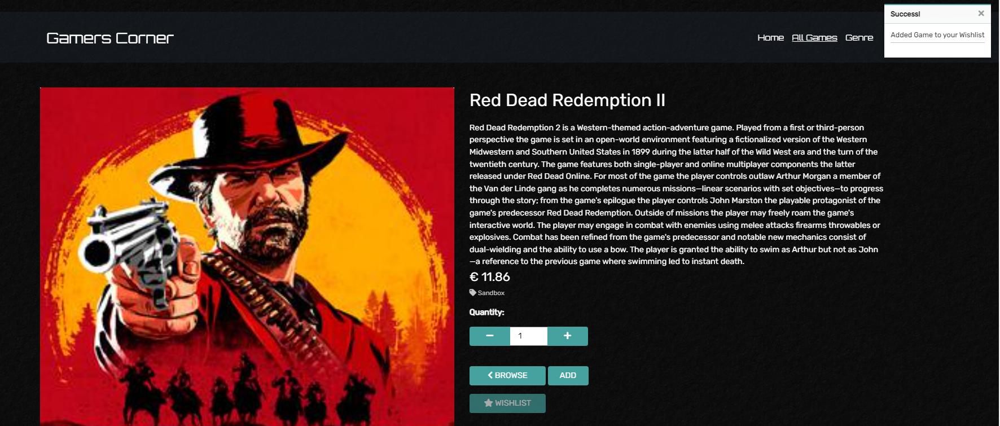

<h1 align="center">Testing</h1> 

- #### Manual Testing was completed using Chrome, Edge, Firefox and Safari. Testing included the testing of all navigation links and the responsiveness of the site across these browsers. 

## Testing the User Experience (UX) stories
## User stories
 -   ### First Time Customer Goals
       1. As a First Time Customer, I want to be able to view a list of games.
             

       2. As a First Time Customer, I want to be able to view an induvial games details.
             

       3. As a First Time Customer, I want to be able to view my total purchases. 
             

       4. As a First Time Customer, I want to be able to view the products I have selected.
             

       5. As a First Time Customer, I want to be able to setup a user account / registration.
             
 
 -   ### Returning or Frequent User Goals
       1. As a Returning User, I want to be able to log in. 
             
            

       2. As a Returning User, I want to be able to log out. 
             
            

       3. As a Returning User, I want to be able delete my account. 
            

       4. As a Returning User, I want to be able add personal details. 
            

       5. As a Returning User, I want to be able update personal details. 
            

       6. As a Returning User, I want to be able view my order history. 
            
      
       7. As a Returning User, I want to be able to reset my password. 
             
            
 
 -   ### Frequent Administrator Goals
       1. As a Frequent Administrator, I want to be able to add products to the site. 
             
            

       2. As a Frequent Administrator, I want to be able to update product details. 
            

       3. As a Frequent Administrator, I want to be able to delete products from the site. 
            
 
 -   ### Sorting and Searching Goals
       1. Sort a list of Products, either alphabetically A-Z or Z-A. 
            

       2. Search for a Product, either by description or by name.  
             
            

       3. Sort Products in a category. 
            

 -   ### Purchasing and Checkout Goals
       1. Add a product to the cart. 
             
             
            

       2. Update the induvial product quantities. 
             
            

       3. Remove a product from the cart. 
            

       4. Purchase the products in the cart. 
            
      
       5. Checkout Success of a purchase / order. 
            

       6. Sent confirmation email of a purchase / order. 
            

 -   ### Review Goals
       1. Add a review to a game. 
          Anonymous User View 
           
          Logged in User View 
           
          Adding a Review 
           
          Review Added 
          
       2. Edit a review on a game, Admin can Edit all reviews, Logged in users can Edit only their reviews. 
          Edit a Review  
           
          Review Edited 
          
       3. Remove a review on a game, Admin can Remove all reviews, Logged in users can Remove only their reviews. 
          Delete a Review  
           
          Review Deleted 
          

 -   ### Wishlist Goals
       1. Add a game to a Wishlist. 
          Anonymous User View 
           
          Logged in User View 
           
          Adding to Wishlist 
           
          View Wishlist 
           
          Limit Wishlist 
          
       3. Remove a game from Wishlist, Logged in users can Remove only games from their Wishlist. 
          Delete from Wishlist  
           
          Wishlist Deleted 
          